サンプルアプリ「気分屋aibo」について紹介していきます。まずはここからはじめていきましょう！

##### :warning: 注意:

> 本ページで紹介している手順や、webページ、画面はすべて公開当時のものです。最新版では、UIが変わっている可能性があります。ご注意ください。

> 現在公開されているサンプルコードは、複数のaiboが登録されているアカウントに対応できていない部分があります。あらかじめご了承ください。

## 気分屋aibo

下記のような流れで、サンプルアプリ「気分屋aibo」について解説しながら、実際に開発をしていきます。まずはこのアプリを動かしてみたい、という方は、[開発手順](#develop)の項目からはじめてください。

* [準備](#get-ready) 
* [サンプルアプリ「気分屋aibo」とは](#what-is-kibunya-aibo) 
* [システム構成](#system-configuration)
* [ファイル構成](#file-configuration)
* [コード解説](#code-explained)
* [開発手順](#develop)
* [動作確認](#check)

<a id="get-ready"></a>
### 準備
まずは、GitHubリポジトリから[本サンプルアプリのソースコードをダウンロード](https://github.com/sony/aibo-development-tutorial/archive/refs/heads/main.zip)します。ダウンロードができたら、好きなディレクトリに展開しておきましょう。

<a id="what-is-kibunya-aibo"></a>
### サンプルアプリ「気分屋aibo」とは

サンプルアプリ「気分屋aibo」とは、aiboに「おはよう」と言うと、aiboの気分に応じてさまざなふるまいを実行してくれるシンプルな連携アプリです。

開発内容: 

* aiboが検知した言葉を外部に通知する仕組み（Events API）を使い、aiboが「おはよう」と言われたときに、aiboの気分に応じて、`とっても喜ぶ`、`顔を洗う仕草をする`、`ブルッと震える`のいずれかのふるまいを実行させます。（Action API）
* 「気分屋aibo」のアプリについて紹介し、連携を促すwebページを作成します。このページから「連携する」ボタンを押すと、下図「連携画面の流れ」のように連携が進むようにします。

<div align="center">
   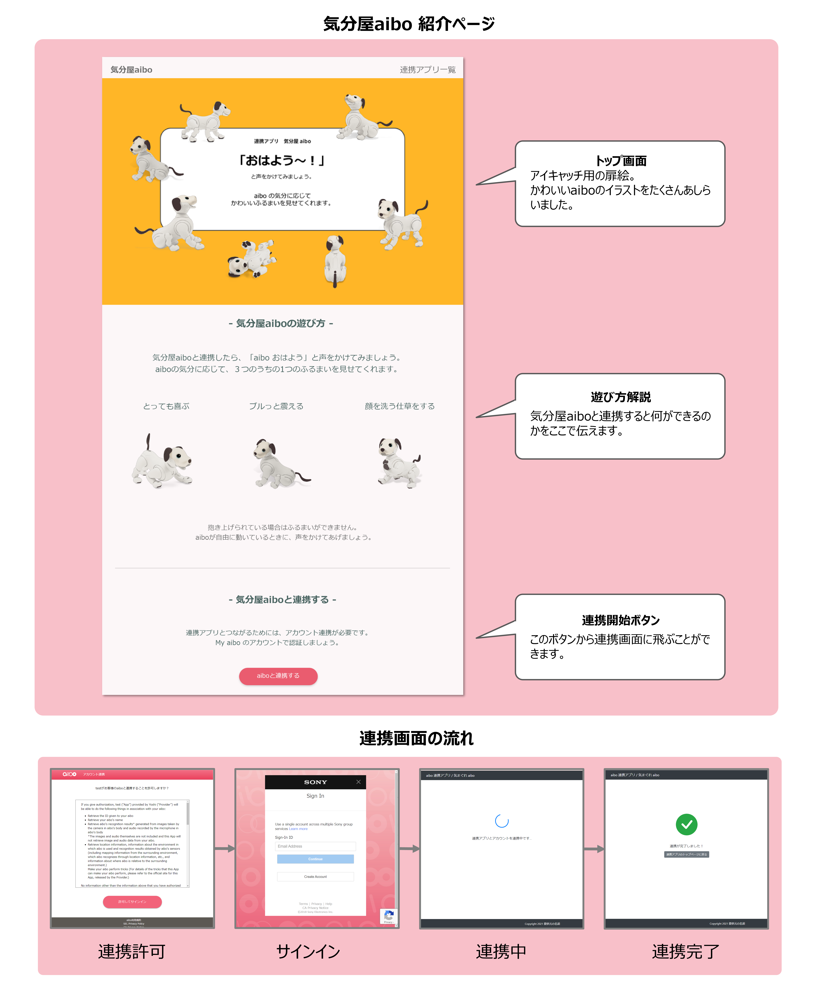
</div>

<a id="system-configuration"></a>
### システム構成

本アプリでは、Google Cloud Platform (GCP) *1を利用しています。本システムの構成を下記に示します。

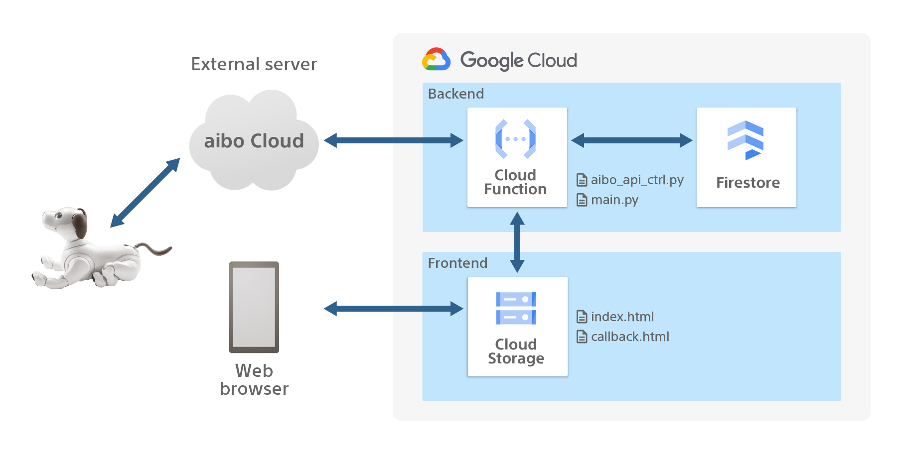


上記図中の濃い青色で囲われた箇所は、実際に開発していくwebアプリの、バックエンド/フロントエンドにあたります。また、図中のaibo Cloudは既に用意されているサーバーで、aiboとwebアプリを中継する存在です。

* フロントエンド
   * Cloud Storage
      * 気分屋aiboの顔となるページです。気分屋aiboについてオーナーに紹介し、連携を促します。このページに配置されている「連携する」ボタンを選択することで、実際に連携が開始されます。

* バックエンド
   * Cloud Functions
      * 連携アプリと、オーナーのaiboを実際に連携させる機能を担います。
      * aibo からのイベント通知を受け取ります。イベントに応じたふるまいをaiboに指示する役割があります。
   * Firestore
      * 連携中のaiboに関する情報を保存します。たとえば、[deviceId](https://developer.aibo.com/jp/docs#d)、 [access token](https://developer.aibo.com/jp/docs#%E3%81%82%E8%A1%8C)などがこれにあたります。

* 外部サーバー
   * aibo Cloud
      * Events API、 Action APIの接続先となります。aiboからのイベント検知、aiboへの動作指示の中継を行います。
      * Cloud Functionsでデプロイしたサーバーの認証を行います。

> **_(*1) コラム: GCP (Google Cloud Platform) とは_** 
Google が展開するクラウドサービスです。GCPでは、web開発に必要な多種多様なツールがクラウド経由で提供されています。例えば、GCPサービスの一つである`Cloud Functions`を使えば、サーバーの構築/保守などについて意識することなく、アプリケーションを実行できるようになります。また`Cloud Functions`は使用された分のみの従量課金制となるため、個人開発の規模であれば低額な料金で利用することができます。(料金については、必ずご自身で[公式ページ](https://cloud.google.com/functions/pricing?hl=ja#cloud-functions-pricing)をご確認ください)


<a id="file-configuration"></a>
### ファイル構成

ファイル構成は、下記の通りです。大まかにはGCPのサービスごとに（Cloud Functions、Cloud Storage）フォルダーが分かれています。

```
.
├── CloudFunctions
│   ├── aibo_api_ctrl.py
│   └── main.py
│   └── requirements.txt
└── CloudStorage
    └── callback.html
    └── index.html
```

- `CloudFunctions/main.py`
   - 気分屋aiboのバックエンド側メイン処理になります。連携やAction API、Events APIなど、すべての処理の大枠がここに書かれています。

- `CloudFunctions/aibo_api_ctrl.py`
   - `main.py`で`aibo_api_ctrl`として読み込まれるコードです。`main.py`にて実行する内容の詳細が記述されています。

- `CloudFunctions/requirements.txt`
   - GCPへのデプロイ(*2)時に必要な設定が書かれています。

- `CloudStorage/index.html`
   - 気分屋aiboのトップページとなるhtmlファイルです。連携アプリの[エントリーURL](https://developer.aibo.com/jp/docs#%E3%81%82%E8%A1%8C)として設定されます。
   - フロンドエンドのコードでは、簡単にUIを構築するための CSS フレームワークとして [Bootstrap](https://getbootstrap.com/) を利用しています。

- `CloudStorage/callback.html`
   - 認証完了後に、リダイレクトされるページです。[リダイレクトURL](https://developer.aibo.com/jp/docs#%E3%82%89%E8%A1%8C)として設定されます。
   - 認証処理後の結果（`認証完了`、`認証エラー`、`通信エラー`など）を提示します。

> **_(*2) コラム: デプロイとは_** 
デプロイとは、プログラムやファイルなどを実際に動かせる状態にすることを言います。pythonファイルやhtmlファイルを単に作成するだけでは、インターネット上で実際に動作する状態にはなりません。作成したファイルが動作するように様々な設定をすることを「デプロイ」 (日本語訳：配備・配置)といいます。

<a id="code-explained"></a>
### コード解説

バックエンドの処理内容を、実行の流れに沿って解説していきます。

##### 1. 外部からのリクエスト処理をメイン関数で受け取り、その内容を読み取る

   `CloudFunctions/main.py`
   ```python
   # ..(省略)..
   def hello_world(request):
      # ..(省略)..

      # リクエスト情報の取得
      request_json = request.get_json()
      print(request_json)
   ```
   `hello_world()`に書かれている内容が、本サンプルアプリのメイン処理となります。
   `hello_world()`は、外部からのリクエスト情報（後述）が`hello_world()`の引数`request`に格納されて、呼び出されます。
   まずは、この`request`の内容をjson形式に変換し、プログラムで読み取れる状態にします。


##### 2. リクエストの内容に応じて、実行する処理を振り分ける

   `CloudFunctions/main.py`
   ```python
   # ..(省略)..

   # エンドポイントの検証
   if 'eventId' in request_json and request_json['eventId'] == 'endpoint_verification':
      print("エンドポイントの検証")
      return request_json

   # aibo APIの実行
   if 'eventId' in request_json:
      print("aibo APIの実行")
      res = aibo_api_execute(request_json)
      # レスポンス
      if res:
         headers = {
         }
         return ('Success!', 200, headers)
      else:
         headers = {
         }
         return ('Failed', 500, headers)

   # OAuth認証
   if 'code' in request_json:
      print("連携処理の実行")
      aibo_oauth_execute(request_json)
      # ..(省略)..
      return ('Success!', 200, headers)
   ```

   json形式に変換した`request_json`に応じて、実行する内容を振り分けます。下記3つの処理のうち1つを実行します。
   * エンドポイント検証 ([aibo CloudにGCPエンドポイントの通知先を設定します](#config-aibo-cloud) の項で後述)
   * aibo APIの実行
   * OAuth認証 (連携を行う)

##### 3. aibo APIの実行
   `CloudFunctions/main.py`
   ```python
   # ..(省略)..

   def aibo_app(access_token, device_id, eventId):
      # 「おはよう」と言われたとき
      if eventId == 'voice_command::goodmorning':
         # aiboの気分を0から2の整数でランダムに設定
         kibun = random.randint(0, 2)

         # 気分に応じてふるまいを実行
         if kibun == 0:
            print("とっても喜ぶ")
            res = aibo_api_ctrl.aibo_control_sync(access_token, device_id, 'play_motion', '{"Category":"overJoyed","Mode":"NONE"}') # とっても喜ぶ
         elif kibun == 1:
            print("顔を洗う仕草をする")
            res = aibo_api_ctrl.aibo_control_sync(access_token, device_id, 'play_motion', '{"Category":"washFace","Mode":"NONE"}') # 顔を洗う仕草をする
         else:
            print("ブルッと震える")
            res = aibo_api_ctrl.aibo_control_sync(access_token, device_id, 'play_motion', '{"Category":"jiggle","Mode":"NONE"}') # ブルッと震える
         return res
      else:
         return True
   ```
   実際にaiboにAPI実行を指示している処理について解説します。
   * `aibo_app`という関数の引数`eventId`に、aiboが検知したイベントの内容が伝えられます。
   * 上記の`eventId`を見て、「おはよう」と言われた場合にだけ、aiboに指示を出すようにします。
   * aiboの気分は、0から2の整数でランダムに設定します。このランダムな数字に応じて、実行する内容を決めます。
   * aiboに指示する内容は、`aibo_control_sync`という関数で指定します。
   * aiboに指示する内容を上記の関数に渡すと、関数内部でAction APIが呼ばれaiboがふるまいを見せてくれます。

<a id="develop"></a>
### 開発手順
気分屋aiboは、下記の手順で開発していきます。

|  手順  | 内容 |  作業場所  |
| ---- | ---- | ---- |
|  1  | [気分屋aiboを連携アプリとして登録する](#register-kibunya-aibo) | aibo デベロッパーサイト |
|  2  | [気分屋aiboの認証情報をコードに反映する](#input-auth-info) | ローカルフォルダー（`./CloudFunctions`） |
|  3  | [気分屋aibo をデプロイする](#deploy-kibunya-aibo) | Google Cloud Platform, ローカルフォルダー（`./CloudFunctions, ./CloudStorage`） |
|  4  | [aibo CloudにGCPエンドポイントの通知先を設定する](#config-aibo-cloud) | aibo デベロッパーサイト |
|  5  | [aibo Cloudへ通知するイベントを設定する](#event-setting) | aibo デベロッパーサイト |

作業内容を[aibo デベロッパーサイトの図](https://developer.aibo.com/jp/docs#aibo-events-api-%E5%AE%9F%E8%A1%8C%E3%81%AE%E6%B5%81%E3%82%8C)と対応させて図示すると、下記のようなイメージになります。
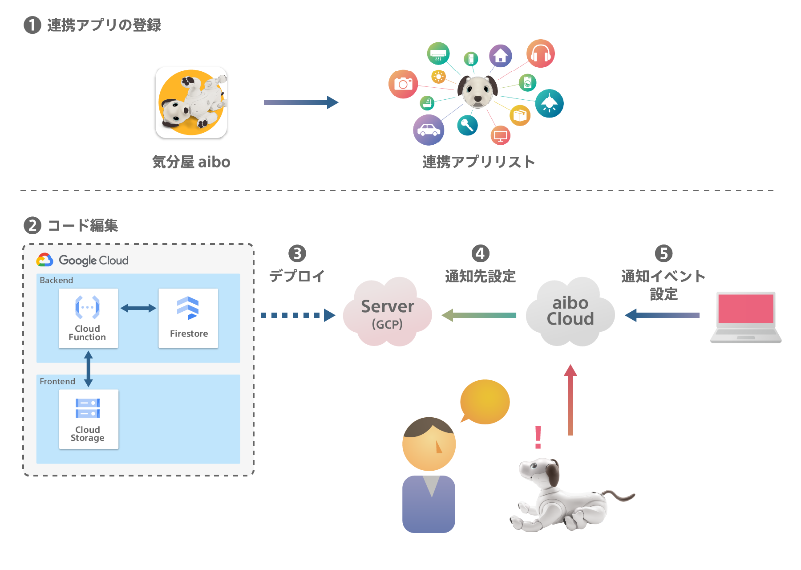

<a id="register-kibunya-aibo"></a>
#### 1. 気分屋aiboを連携アプリとして登録する

aibo デベロッパーサイトの開発者設定へサインインします。
[作成した連携アプリ](https://developer.aibo.com/jp/settings/myapp)の項目をクリックして、「新しく連携アプリを作成する」ボタンをクリックします。

   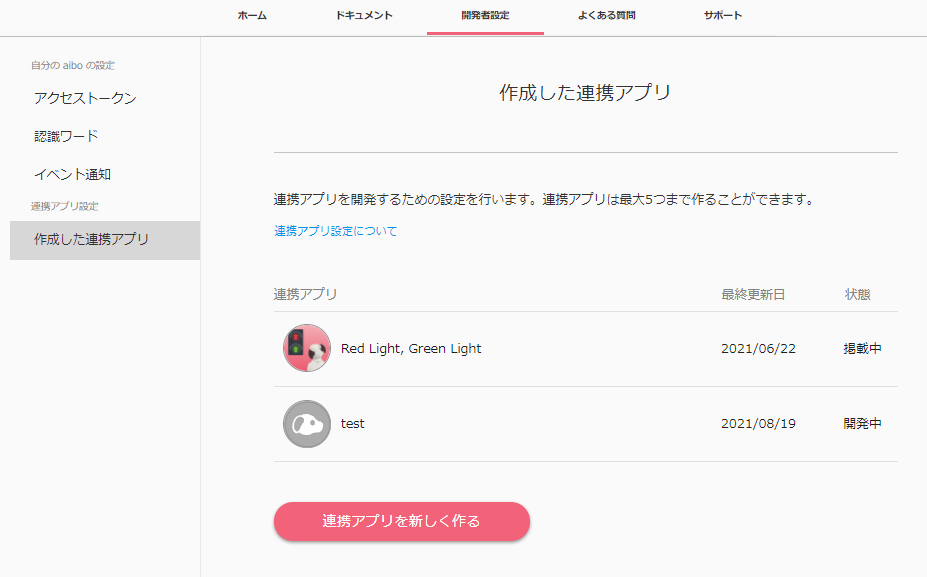 

連携アプリ名や、連携アプリの説明を入力していきます。
ここまでで、気分屋aiboを連携アプリとして登録し、実際に開発を行う準備が整いました。

> **_TIP:_** 上記の連携アプリの情報を設定した段階では、連携アプリ一覧に公開されることはありません。ここで入力した内容は別途「掲載申請」を行って審査に合格すると公開されます。詳しくはデベロッパーサイトの[連携アプリの掲載申請](https://developer.aibo.com/jp/docs#%E9%80%A3%E6%90%BA%E3%82%A2%E3%83%97%E3%83%AA%E3%81%AE%E6%8E%B2%E8%BC%89)を参照してください。

<a id="input-auth-info"></a>
#### 2. 気分屋aiboの認証情報をコードに反映する

1. 気分屋aiboを連携アプリとして登録した際に生成された、`クライアントID` と `クライアントシークレット` をコピーし、手元のメモ帳などに記しておきます。

   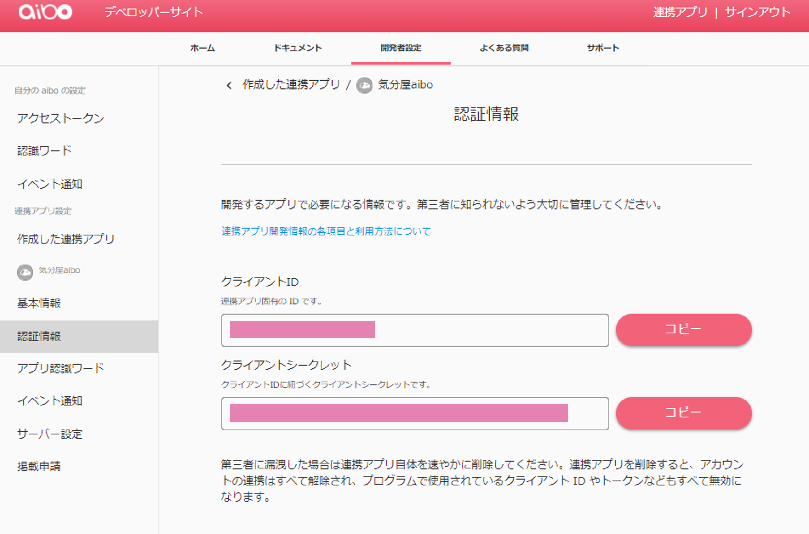

   :bulb: 開発のポイント1:
   > **_POINT1:_**  `クライアントID` と `クライアントシークレット`は今後複数回使用します。分かりやすいようにメモしておきましょう！

1. サンプルコードを修正します。
    - `CloudFunctions/main.py` を編集し、`CLIENT_ID` と `CLIENT_SECRET` を1.でコピーした値に書き換えます。

      `CloudFunctions/main.py 10行目`
      ```python
      # 連携アプリの情報
      CLIENT_ID = 'XXX'
      CLIENT_SECRET = 'XXX'
      ```
   まだソースコードをダウンロードしていない場合は、GitHubリポジトリから[ソースコードをダウンロード](https://github.com/sony/aibo-development-tutorial/archive/refs/heads/main.zip)して、好みのフォルダーへ展開してから、編集しましょう。
   
<a id="deploy-kibunya-aibo"></a>
#### 3. 気分屋aibo をデプロイする

ここからはGCPを使いながら、作業するフェーズにうつります。新しいプロジェクトを追加し、Firestore、Cloud Functions、Cloud Storage をそれぞれ準備します。

1. 新しいプロジェクトの追加
   - GCPにログインします。[Google Cloud Platform](https://console.cloud.google.com/?hl=ja)
      - Googleアカウントを持っていない方は、アカウントを作成してからGCPにログインしてください。
      - Googleアカウントをすでに持っている方でも、Google Cloud Platformへの登録とクレジットカードの登録が必要になります。
   - 「aiboSample」という名前で新しいプロジェクトを追加します。
      - Google Cloud Platform の右横にあるボタン（下図）を選択します。

         

      - プロジェクト選択のポップアップが出たら、`新しいプロジェクト`ボタンを押します。
      - プロジェクト名を「aiboSample」として作成します。
1. Firestore の準備
   - コンソール画面の上部にある検索ボックスに「Firestore」と入力して、`Firestore`のプロダクトを選択します。

      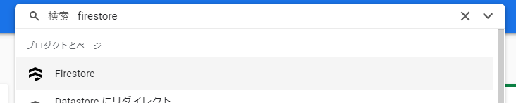

   - Firestoreのモードを選択する画面が現れたら、`ネイティブモード`を選択します。
   - デプロイするロケーションを選択します。
      - 好きなロケーションを選択して、データベースを作成します。ここで選択したロケーションに実際のデータが配置されます。

      > **_NOTE:_**  選択したロケーションによっては、料金が発生する可能性があります。無料枠での利用に適したロケーションの確認には、[Google公式サイト](https://cloud.google.com/storage/pricing?hl=ja)を参考にしてください。


   - `データベースを作成しています。`と表示されている間は数分間待ちましょう。リダイレクト先に空のデータベースが作成されれば、このステップの準備は完了です。

      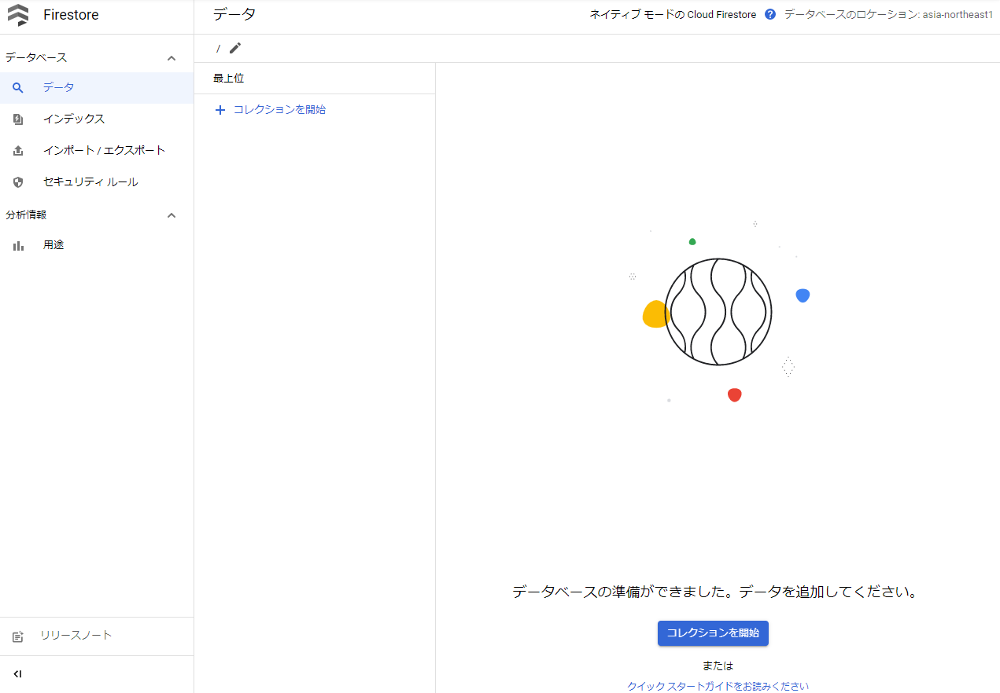

1. Cloud Functions の準備
   - コンソール画面の上部にある検索ボックスに「Cloud Functions」と入力して、`Cloud Functions`のプロダクトを選択します。

      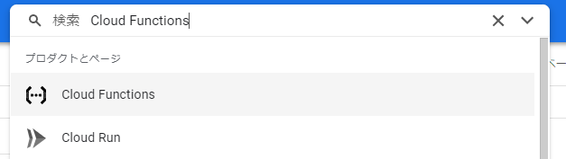

   -  `関数を作成`を押します。
   - はじめてCloud Functionsを使用する場合には、必要なAPIを有効化します。
   -  関数を下記のように設定します。
      - 関数名: my-linkable-app
      - リージョン: Firestoreと同じ地域を選択
      - トリガータイプ: HTTP
      - 未認証の呼び出しを許可
      - `HTTPSが必須`にチェック
   -  下記のような画面に遷移します。

      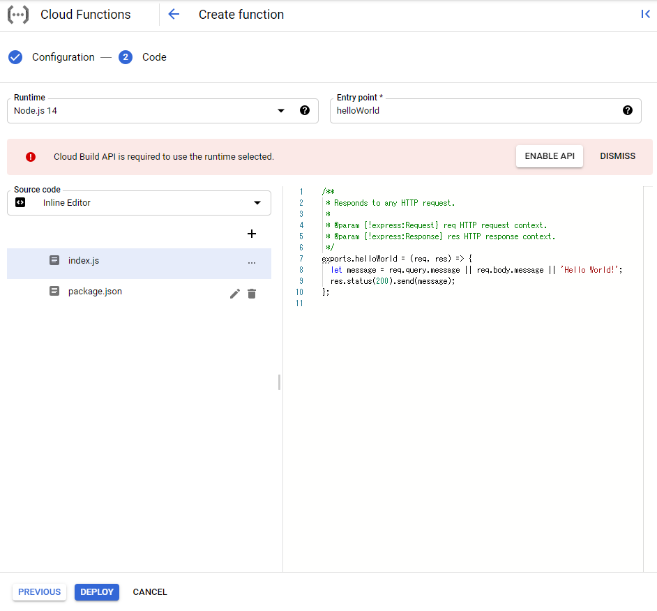
   -  Cloud Build APIについての警告が出る場合は、`APIを有効にする`をクリックして、Cloud Build APIを有効にします。
         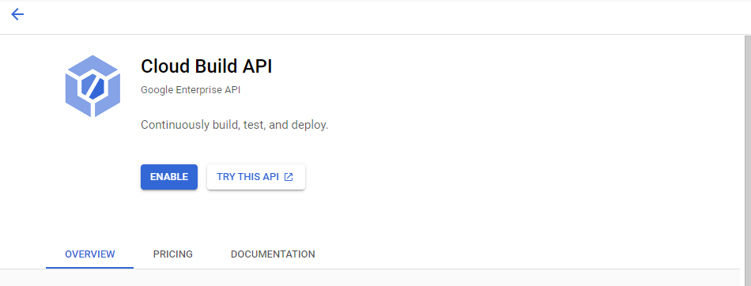
   -  元の画面に戻り、関数内で使用する言語（ランタイム）を、Python 3.9に設定します。
   -  次に、ローカルにある`CloudFunctions`フォルダーの中の、`main.py`、 `requirements.txt`、`aibo_api_ctrl.py`をクラウド上にアップロードします。
      -  `main.py`、 `requirements.txt`については、ローカルのコードをそれぞれコピーして、クラウド上ファイルにペーストします。
      -  `aibo_api_ctrl.py`は、`＋（プラス）`ボタンを押して新しくファイルを作成してから、ローカルのファイルの内容をペーストします。
      -  `デプロイ`ボタンを押します。

      > **_TIP:_**  デプロイが完了するには数分間かかる場合があります。しばらく待ちましょう:tea:

   -  関数がデプロイできたら、デプロイ先のURLをメモします。
      - "my-linkable-app"をクリックして、関数のダッシュボードページを開き、トリガータブを選択してトリガーURLをコピーします。
      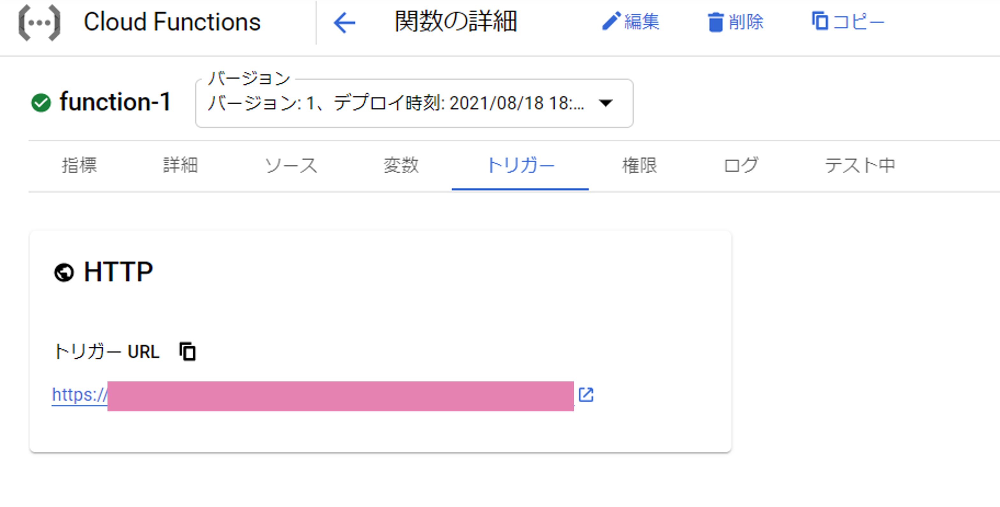
      
      :bulb: 開発のポイント2:
      > **_POINT2:_**  今コピーしたトリガーURLが、認証許可エンドポイントのURLになります。"エンドポイントURL"としてメモしておきましょう。

1. Cloud Storage の準備
   - コンソール画面の上部にある検索ボックスに「Cloud Storage」と入力して、`Cloud Storage`のプロダクトを選択します。
   
      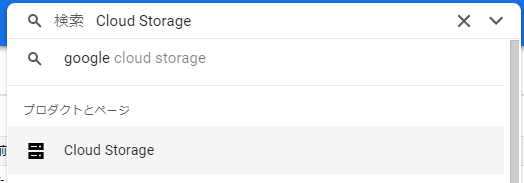

   -  `バケットを作成`ボタンを押し、下記の条件で新しいストレージを作成します。リージョンについてはFirestore、Cloud Functionsと同じ、もしくは近い場所を選択してください。

      - バケット名: my-linkable-app_XXX (*3)
      - ストレージクラス: Standard
      - アクセス制御: 均一

      なおバケットに対する公開アクセス禁止は**適用しません**。チェックボックスには、チェックを付けずに進みます。

      > **_(*3) バケット名について_**  バケット名は、リージョンごとに一意の名前が必要です。(他のユーザが既に使用している名前は使用できません。) XXXには、123など好きな数字を入れておきましょう。
   -  インターネット上から誰でもアクセスができるように、権限の設定を行います。

      -  権限のタブをクリックし、`権限を追加`ボタンを押します。
      -  新しいプリンシパルに、allUsersと入力して、ロールに`Storage オブジェクト閲覧者`と入力します。

      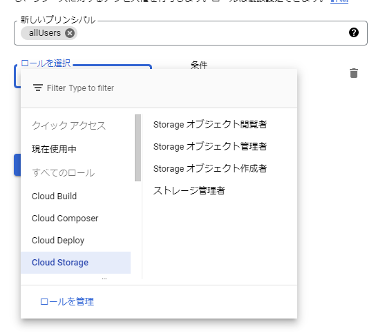
   
   -  ローカルの`CloudStorage/callback.html` を編集します。
      - コード内の認証認可エンドポイントを、開発のポイント2でメモした`エンドポイントURL`に書き換えます。

          `CloudStorage/callback.html 111行目`
          ``` javascript
          const auth_endpoint = `https://xxx`
          ```

   -  `オブジェクト`タブをクリックし、編集した`callback.html` をCloud Storage にアップロードします。
      - アップロードされたら`callback.html`を選択し、公開URLを`コールバックURL`としてメモしておきましょう。
    -  `CloudStorage/index.html` を編集します。
       - コード内の下記2つの変数をメモ帳の値に書き換えます。
          - `client_id`を、`クライアントID`に書き換えます。
          - `redirect_uri`を、`コールバックURL`に書き換えます。

         `CloudStorage/index.html 170行目`
         ``` javascript
         const client_id = 'XXX';
         const redirect_uri = 'https://xxx';
         const region = 'JP';
         ```

    -  `CloudStorage/index.html`をCloud Storage にアップロードします。
         - アップロードされたら`index.html`を選択し、公開URLを`フロントページURL`としてメモしておきましょう。

   - `CloudStorage/image`以下のpngファイル群をCloud Storage にアップロードします。`CloudStorage/image`のフォルダーごとドラッグ＆ドロップしてアップロードできます。

      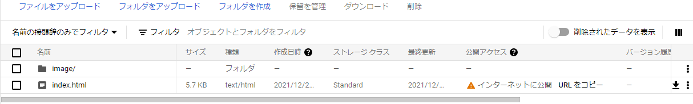

   :bulb: 開発のポイント3:
   > **_POINT3:_**  "Cloud Storage の準備"の項目では、新しく２つのURLをメモしました。(`コールバックURL`, `フロントページURL`) 

   :triangular_flag_on_post: 「気分屋aibo のデプロイ」のまとめ: 
   > **_well done!:_** おつかれさまです！ ここまでで「気分屋aibo をデプロイする」が完了しました。
   これで気分屋aiboのフロント・バックエンド両方がインターネットから実際にアクセスできる形になったはずです。これ以降は、この両方のリソースとソニーが提供するaibo Cloudをつなぐ設定に移ります。つなぐ設定をすることで、今回デプロイしたリソースとaibo Cloudが連携して動作するようになります。

<a id="config-aibo-cloud"></a>
#### 4. aibo CloudにGCPエンドポイントの通知先を設定する

aibo デベロッパーサイトで、連携アプリに必要な設定を行います。
   1. エンドポイントの設定を行います。
      - 今回作成した、[アプリ名]の連携アプリ設定のページに進みます。

         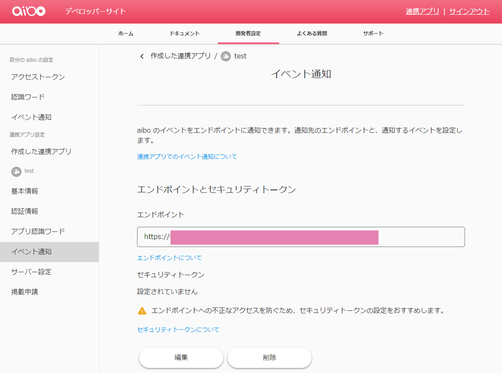

      - エンドポイントに、`エンドポイントURL`としてメモしたURL（Cloud Functionsへのデプロイ先）を設定します。

         ```
         https://xxx
         ```
      - エンドポイントを設定すると、エンドポイントの検証が行われ、検証に成功すると登録が完了します。

   1. 連携アプリのサーバー設定をします。

      最後に、下記の画面のように`サーバー設定`のタブを開き、`編集`ボタンを押して下記3つのURLを記入します。
      - 連携アプリのエントリーURL に、 `フロントページURL`を設定
      - 認証後のリダイレクトURL に、 `コールバックURL`を設定 
      - 連携中のアプリのURL に、 `フロントページURL`を設定
      
      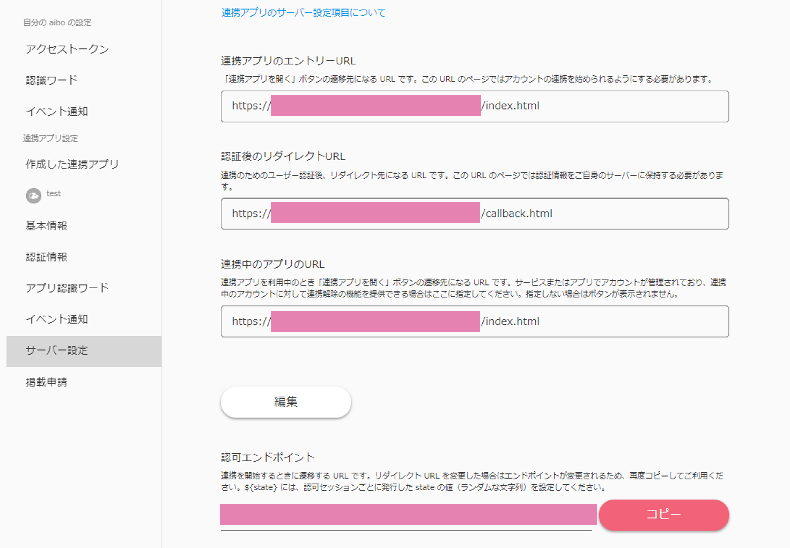

<a id="event-setting"></a>
#### 5. aibo Cloudへ通知するイベントを設定する
   - Cloud Functionsへデプロイした関数に通知するイベントを追加します。
   - 本サンプルアプリでは、音声コマンド`goodmorning`を選択して追加します。
      - イベント通知のタブから、通知するイベントの`追加`ボタンをクリックします。
      - 音声コマンド項目から`goodmorning`を選び、追加します。
      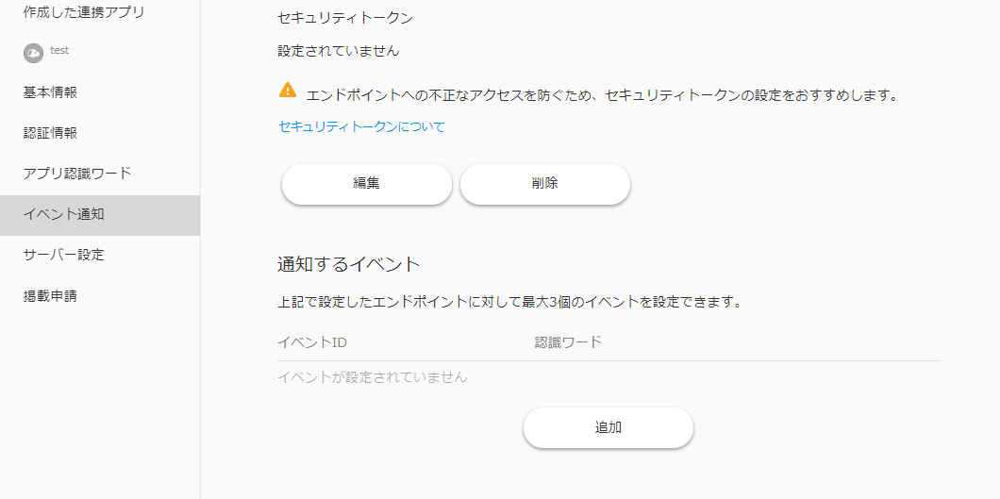

<a id="check"></a>
### 動作確認

ここまで来れば、実際に気分屋aiboが動作する準備が整いました。ここからは、期待通りに動作するか確認していきましょう。

##### 気分屋aiboと連携する
   1. メモしておいた`フロントページURL`をWebブラウザで開きます。
   1. 「気分屋aibo」のwebページが表示されたら、`aiboを連携する` ボタンを押します。
   1. 以下のような流れでページが遷移し、連携完了ページが表示されれば、連携完了です。
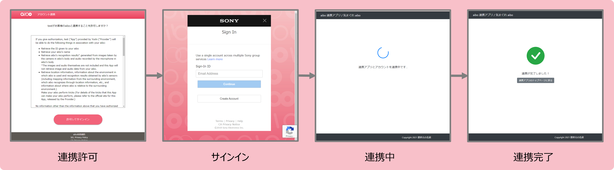

##### 気分屋aiboを動かす

   1. （任意）aiboを指示待ち状態にします。 

      「気分屋aibo」アプリによる動きを確認しやすくするため、aibo ビジュアルプログラミングを使って、aiboを「指示待ち中」にします。
      * [aibo ビジュアルプログラミング](https://visual-programming.aibo.com/jp/)にサインインします。
      * ブロックが並んでいる左側のタブから、`指示待ち中になる`ブロックを選択します。
         * `指示待ち中になる`ブロックは、`動き`という区分に配置されています。下の方までスクロールして探してみましょう。

      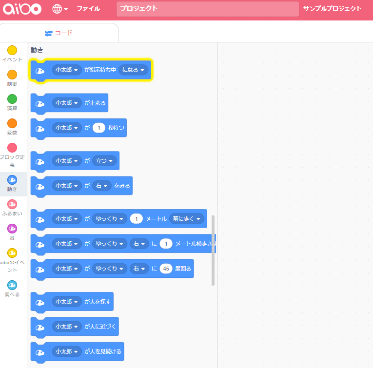
      
      * aiboが指示待ち状態に入ると、オーナーからの指示を待機する状態に入ります。

   1. 「おはよう」と言うと、aiboが下記のうちいずれかのふるまいをしてくれます。
      * `とっても喜ぶ`
      * `顔を洗う仕草をする`
      * `ブルッと震える`

